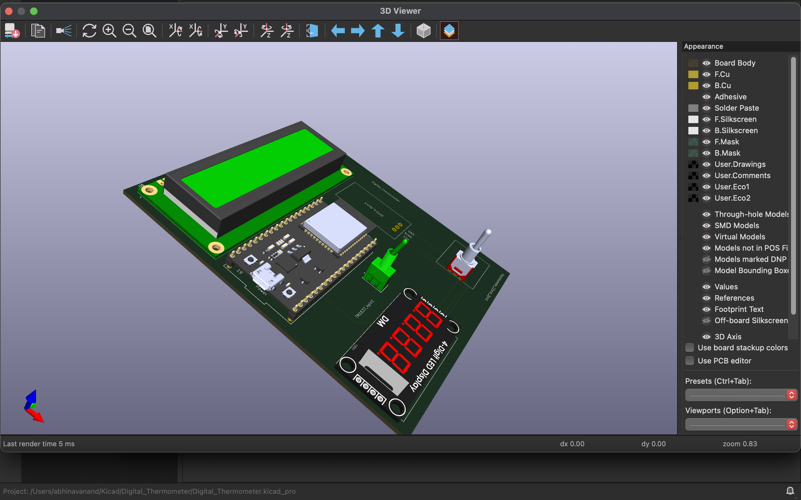
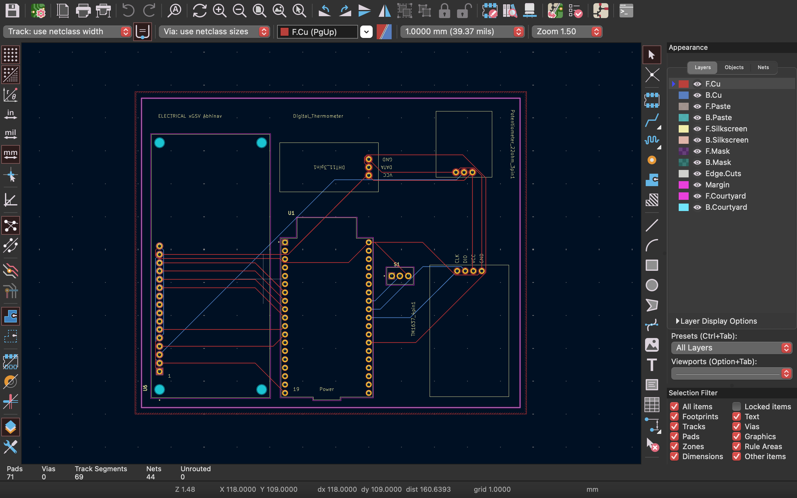

# Digital Thermometer using ESP32

## Project Overview
**Digital Thermometer** built using an **ESP32 NodeMCU-32S** microcontroller. It measures **temperature** and **humidity** using a **DHT11 sensor** and displays the data on:
- A **TM1637 4-digit 7-segment display**
- A **16x2 LCD (parallel) display**

The data shown on the 4-digit display depends on the state of a **toggle switch**, allowing the user to switch between temperature and humidity. The 16x2 LCD shows the **day, time, and date** (without using an RTC module).

---

## Components Used
- **ESP32 NodeMCU-32S**
- **DHT11 Temperature & Humidity Sensor**
- **TM1637 4-Digit 7-Segment Display**
  - CLK → GPIO 5  
  - DIO → GPIO 18
- **16x2 LCD Display (Parallel)**
  - RS → GPIO 14  
  - E → GPIO 27  
  - D4–D7 → GPIO 26, 25, 33, 32  
  - Potentiometer: 22kΩ (for contrast adjustment)
- **Toggle Switch** → GPIO 19
- **Jumper Wires, Breadboard, and Power Supply**

---

## Features
- Real-time temperature and humidity reading via DHT11
- Toggle switch to display either **temperature** or **humidity** on TM1637
- Display **day (short form)**, **time**, and **date** on 16x2 LCD
- No RTC module used – uses ESP32 system time

---

## How It Works
- The **DHT11 sensor** reads temperature and humidity.
- The **toggle switch** lets the user choose what the TM1637 displays:
  - Switch OFF: Temperature displayed
  - Switch ON: Humidity displayed
- The **16x2 LCD** continuously displays:
  - Day of the week (e.g., Mon, Tue)
  - Time (HH:MM:SS)
  - Date (DD-MM-YYYY)
- ESP32 system time is set at startup manually or using `configTime()` (if WiFi is used).

---

##  Wiring Diagram

<object data="images/Schematic_Thermometer.pdf" type="application/pdf" width="100%" height="600">
  
Your browser doesn’t support inline PDFs.  
     <a href="images/Schematic_Thermometer.pdf">Download the PDF</a> instead.
  

</object>

---

## Code Overview
The code is written in **Arduino (C++)**, using the following libraries:
- `DHT.h` – for reading sensor data
- `TM1637Display.h` – to control the 4-digit 7-segment display
- `LiquidCrystal.h` – to drive the 16x2 LCD
- `Wire.h` – general purpose I2C (optional)
- `time.h` – for internal clock to get time and date

---

## How to Use
1. Connect all components as per the wiring section.
2. Upload the code to the ESP32 using Arduino IDE.
3. Power on the ESP32 board.
4. The display will show:
   - Temperature or humidity on the 4-digit display (based on toggle switch)
   - Day, time, and date on the 16x2 LCD

---

## Future Improvements
- Add **RTC module** for accurate timekeeping even after power loss.
- Replace DHT11 with **DHT22** or **BME280** for better accuracy and more data.
- Integrate with **WiFi** or **Bluetooth** to remotely view sensor data.
- Add an **OLED display** for better graphics.
- Firebase integration for storing the data.

---

## Author & Credits
Made by **[Abhinav Anand]**  
Built using **ESP32, Arduino IDE**, and open-source libraries.

---

## Project Images(3d view)
Check this out.

> *(inside Kicad and one component is missing)*

---
### KiCad PCB Layout
Custom PCB layout designed for the digital thermometer using KiCad. The board integrates all components on a single PCB.

> *Custom PCB layout created using KiCad.*

---

## License
---

This project is licensed under the MIT License – see the [LICENSE](LICENSE) file for details.

---